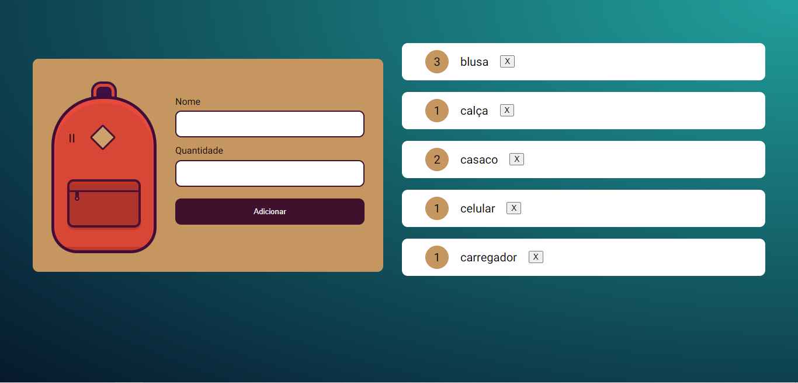
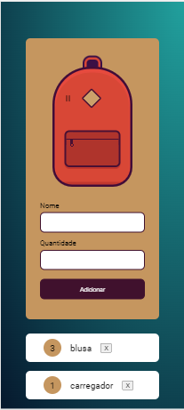

# Projeto Mochila de viagem

É um site para registrar uma lista de itens que não posso esquecer e na hora de montar uma mochila de viagem.  
Projeto do curso de JavaScript na Web: armazenando dados no navegador da Alura. 

<strong>Objetivos:</strong> implementar uma página WEB que armazena dados e os registra no LocalStorage como também criar objetos com JavaScript.  
Foi acrescentando responsividade na página para que funcione também em dispositivos móveis. 

## 💻 Layout  

### Web

  

### Mobile

  

 ## 🔧 Tecnologias 

As tecnologias usadas foram: 
* HTML
* CSS
* JavaScript
